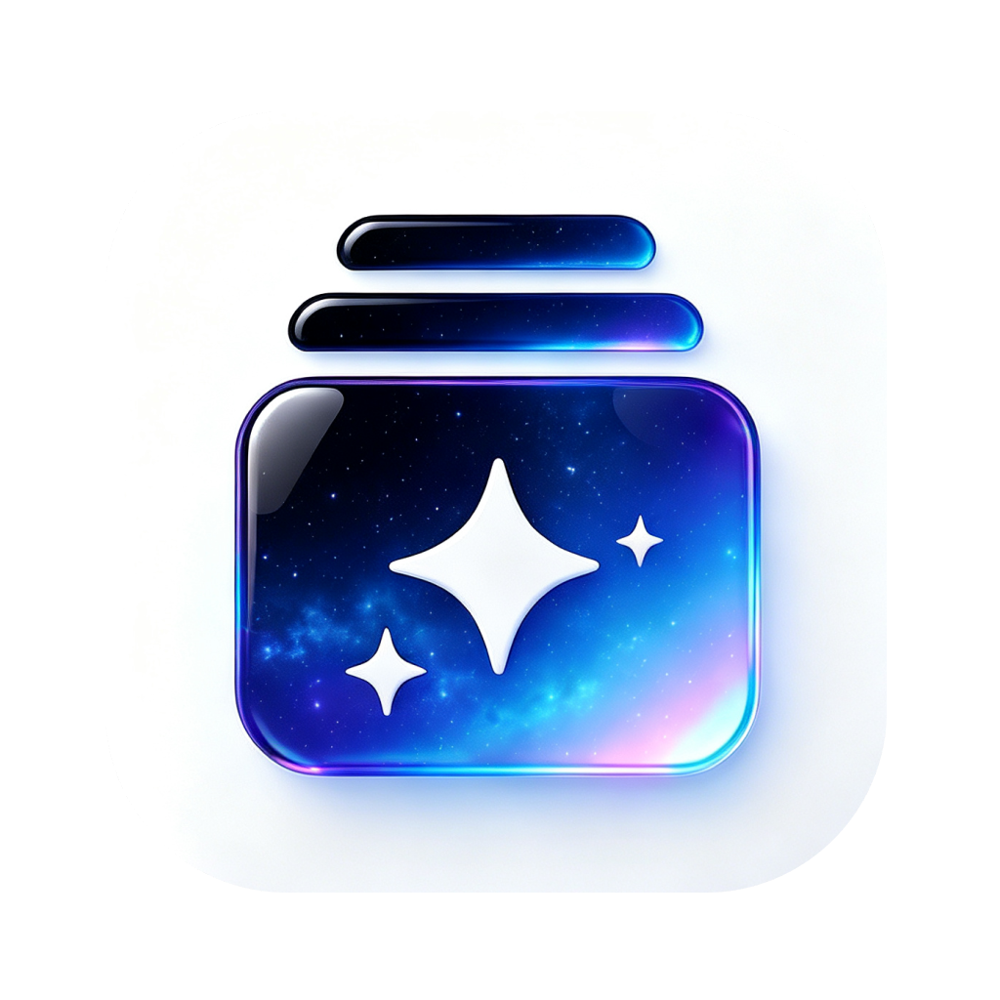

# StarButler (AI 智能体管家)

<div align="center">



**统一管理与监控你所有 AI 智能体应用的全生态管家（Mac 原生 + iOS/iPad 移动伴侣）**

[](https://github.com/rockyleelrf-a11y/StarAiMananger/releases)
[](StarButlerCompanion/)
[](https://github.com/rockyleelrf-a11y/StarAiMananger/releases)
[](https://github.com/rockyleelrf-a11y/StarAiMananger/releases)
[](Sources/)
[](LICENSE)

</div>

---

## ✨ 核心特性

| 功能 | 说明 |
|------|------|
| 🎯 **统一整合** | 集中管理 ChatGPT、Trae、WorkBuddy、豆包工作、MiniMax Code、Antigravity、OpenCode、ZCode 等 |
| 🫧 **原生气泡面板** | 点击状态栏图标滑出原生毛玻璃面板，清晰展示所有 AI 软件运行状态 |
| 🟢 **实时探活** | 自动捕获真实 PID、CPU 负荷，动态展示当前推理任务 |
| 🪙 **Token 统计** | 实时统计今日 / 历史 Token 消耗量（输入 + 输出分开展示） |
| ⚡️ **一键启停** | 未启动的一键启动，运行中的一键置顶或快速关闭 |
| 🔝 **智能排序** | 运行中的智能体自动置顶，关闭后自动下沉 |
| 🪶 **极致轻量** | macOS 原生版 ~380KB，无 Electron，无 Node.js |

---

## 📸 截图

> macOS 菜单栏气泡面板，实时展示所有 AI 智能体状态、任务与 Token 用量

---

## 🚀 快速开始

### macOS（原生 Swift 版）

```bash
# 克隆仓库
git clone https://github.com/rockyleelrf-a11y/StarAiMananger.git
cd StarAiMananger

# 自动化测试
./build.sh check

# 编译并运行
./build.sh run

# 打包 DMG 安装包
./build.sh dmg
```

产物：`build/StarButler.app` 和 `build/StarButler.dmg`

---

### iOS / iPadOS 联动伴侣（StarButler Companion）

采用 **Mac + iOS/iPad 伴侣架构**，Mac 负责本地探活与数据采集，移动端负责实时仪表盘监控、一键远程终止，100% 遵从 iOS App Store 沙盒上架合规规范。

- **极简原生**：采用 Apple 原生 `Network.framework` + Bonjour（`_starbutler._tcp`），零外部依赖。
- **即开即连**：同一局域网下毫秒级自动握手发现，也可通过 IP 手动配对。
- **全功能监控**：实时 Token 消耗、吞吐率 T/s、活跃状态、远程单独或批量终止 AI 软件。

#### 运行与编译

```bash
# 1. 命令行直接编译验证
swift build --package-path StarButlerCompanion

# 2. 或直接通过 Xcode 打开项目进行 iOS / iPad 真机调试或打包上架
open StarButlerCompanion/Package.swift
```

---

### Linux（Python 系统托盘版）

```bash
cd cross-platform
pip install -r requirements.txt
python3 main_linux.py
```

**打包为独立二进制（AppImage）**：

```bash
chmod +x build_linux.sh
./build_linux.sh
# 产物: StarAiManager-linux-x86_64.AppImage 或 dist/StarAiManager
```

---

### Windows（Python 系统托盘版）

```cmd
cd cross-platform
pip install -r requirements.txt
python main_windows.py
```

**打包为 EXE**：

```cmd
build_windows.bat
# 产物: dist\StarAiManager.exe
```

---

## 🛠️ 项目结构

```
StarAiMananger/
├── Sources/                            # macOS 原生 Swift 源码
│   ├── main.swift                      # 入口点（隐藏 Dock 图标）
│   ├── AppDelegate.swift               # 菜单栏 NSStatusItem + NSPopover
│   ├── Models/AIAgentApp.swift         # 智能体数据模型
│   ├── Services/
│   │   ├── AIAgentManager.swift        # 进程监控、启停控制、Token 统计
│   │   ├── AIAgentProber.swift         # 各智能体专属探针（SQLite + 日志）
│   │   └── StarButlerCompanionServer.swift # Bonjour 服务端（实时同步给手机/平板）
│   └── Views/AIAgentViews.swift        # SwiftUI 气泡界面
│
├── StarButlerCompanion/                # iOS / iPadOS 原生伴侣端工程（Swift Package）
│   ├── Package.swift                   # 支持 iOS 16+ / iPadOS 16+ / macOS 13+
│   └── Sources/
│       ├── StarButlerCompanionApp.swift# 移动端应用入口
│       ├── Models/CompanionAgent.swift # 伴侣端数据与网络协议模型
│       ├── Services/CompanionClient.swift # Bonjour 探活客户端 + 远程指令
│       └── Views/
│           ├── CompanionDashboardView.swift  # 实时仪表盘面板
│           ├── CompanionAgentCard.swift      # 智能体卡片
│           └── CompanionConnectionSheet.swift # 局域网主机搜索与连接配置
│
├── cross-platform/                     # 跨平台 Python 版（Linux / Windows）
│   ├── agent_manager.py                # 核心逻辑（进程探测、探针、Token 统计）
│   ├── main_linux.py                   # Linux 系统托盘入口
│   ├── main_windows.py                 # Windows 系统托盘入口
│   ├── requirements.txt                # Python 依赖
│   ├── build_linux.sh                  # Linux 打包脚本（PyInstaller → AppImage）
│   └── build_windows.bat               # Windows 打包脚本（PyInstaller → EXE）
│
├── Resources/
│   ├── Info.plist                      # macOS Bundle 配置
│   └── AppIcon.icns                    # 应用图标（多分辨率）
│
├── logo.png                            # 原始 Logo（1024×1024）
├── build.sh                            # macOS 构建与 DMG 打包脚本
├── run_check.swift                     # Mac 核心探活与 Token 断言测试
├── check_companion.swift               # 移动伴侣局域网回环自动化测试
└── README.md
```

---

## 🤖 支持的 AI 智能体

| 应用 | macOS 探针 | 模型探测 | Token 统计 |
|------|-----------|----------|-----------|
| **TraeWork** (TRAE SOLO CN) | ✅ | ✅ SQLite `state.vscdb` | ✅ |
| **WorkBuddy** | ✅ | ✅ SQLite `workbuddy.db` | ✅ 精确 |
| **Antigravity** | ✅ | ✅ `transcript.jsonl` | ✅ 精确 |
| **豆包工作** | ✅ | ✅ `豆包 2.1 Turbo` | ✅ |
| **Cline** (自主编码智能体) | ✅ | ✅ `sessions/*.json` | ✅ 精确 |
| **阶跃 AI** (StepFun) | ✅ | ✅ `setting.json` / `desktop-share.db` | ✅ |
| **ima.copilot** | ✅ | ✅ 腾讯混元 (ima 智能体) | ✅ |
| **Cursor** | ✅ | ✅ Claude 3.5 Sonnet | ✅ |
| **Windsurf** | ✅ | ✅ Cascade (Flows) | ✅ |
| **Claude** (桌面版) | ✅ | ✅ Claude 3.7 Sonnet | ✅ |
| **ChatGPT** | ✅ | ✅ GPT-4o mini | ✅ |
| **Kimi** (Moonshot) | ✅ | ✅ Kimi k1.5 | ✅ |
| **Ollama** (本地推理) | ✅ | ✅ Llama 3.3 / Qwen 2.5 | ✅ |
| **LM Studio** | ✅ | ✅ 本地多模型调度 | ✅ |
| **Goose** (自主智能体) | ✅ | ✅ Goose Agent | ✅ |
| **StarWriter** | ✅ | ✅ StarWriter Agent | ✅ |
| **MiniMax Code** | ✅ | ✅ MiniMax-ABAB 6.5 | ✅ |
| **ZCode** | ✅ | ✅ ZCode-Core | ✅ |
| **OpenCode** | ✅ | ✅ DeepSeek-Coder | ✅ |
| **Trae CN** | ✅ | ✅ DeepSeek-V4-Flash | ✅ |

---

## 🏗️ 技术架构

### macOS 原生版
- **Swift 5.9 + SwiftUI + AppKit**：零 Electron，零 Node.js 依赖
- **NSStatusItem + NSPopover**：系统原生菜单栏组件
- **SQLite3**：直接读取各 AI 应用的本地数据库（只读模式）
- **NSWorkspace**：进程探活与应用启停

### Linux / Windows 版
- **Python 3.11+**：跨平台
- **psutil**：跨平台进程探测
- **pystray**：跨平台系统托盘
- **Pillow**：动态生成托盘图标
- **PyInstaller**：打包为独立可执行文件

---

## 📄 License

[MIT License](LICENSE)

---

<div align="center">
Made with ❤️ | <a href="https://github.com/rockyleelrf-a11y/StarAiMananger">GitHub</a>
</div>
